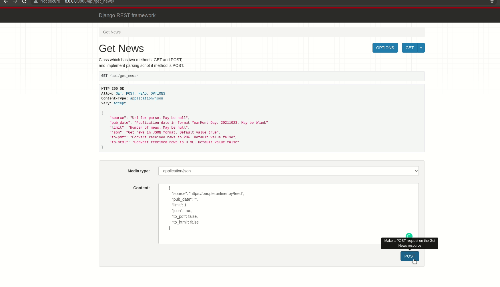

Project description 
===
Web-server that uses Docker + docker-compose. 
The following tasks have been implemented:
* One-shot conversion from RSS to Human readable format.
* Server-side news caching.
* Conversion in html and fb2 formats.

---

## Contents
***
1. [Installation](#Installation)
2. [Usage](#Usage)
3. [Format converter](#Format-converter)
    * [Converter to PDF](#Converter-to-PDF)
    * [Converter to HTML](#Converter-to-HTML)
4. [What's in the future](#What's-in-the-future)

---

## Installation
To install, you need to make a clone of the repository:
```
>>> git clone https://github.com/Aleksey-Mikh/RSS_API.git
```
After that, you need to go to the CLI_util directory:
```
>>> cd your_path/DRF_reader/rss_reader_drf/
```
Then you need to build the docker container:
```
>>> docker-compose up -d --build
```
And start creating databases:
```
>>> docker-compose exec drf_reader python manage.py migrate
```

---

## Usage

We can use http://127.0.0.1:8000/api or http://0.0.0.0:8000/api

To receive news, you need to send a POST request to http://127.0.0.1:8000/api/get_news/

      {
         "source": "https://people.onliner.by/feed",
         "pub_date": "",
         "limit": 1,
         "json": true,
         "to_pdf": false,
         "to_html": false
      }



Viewing all the news is available at http://127.0.0.1:8000/api/news /.

There are 10 news items on one page


When you enter the `date` argument, the news is extracted from the DB. 
Parsing of `source` (if it is specified) does not happen.


---

## Format converter
To receive news in PDF or HTML format, you must specify in the POST request:
`"to_pdf": true` `"to_html": true`

      {
         "source": "https://people.onliner.by/feed",
         "pub_date": "",
         "limit": 1,
         "json": false,
         "to_pdf": true,
         "to_html": true
      }
If the browser does not download the received file, you can take to the page 
http://127.0.0.1:8000/api/download_pdf / or http://127.0.0.1:8000/api/download_html /
depending on the selected format.

Downloading by POST request occurs in Postman, browsers sometimes do not want to work ¯\_(ツ)_/¯.
## Converter to PDF

## Converter to HTML


---

## What's in the future

I'm going to add automatic receiving of new news and receiving news from a given source